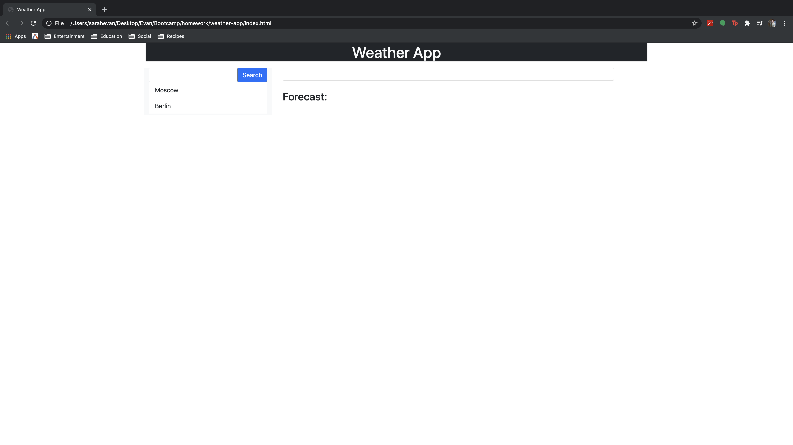
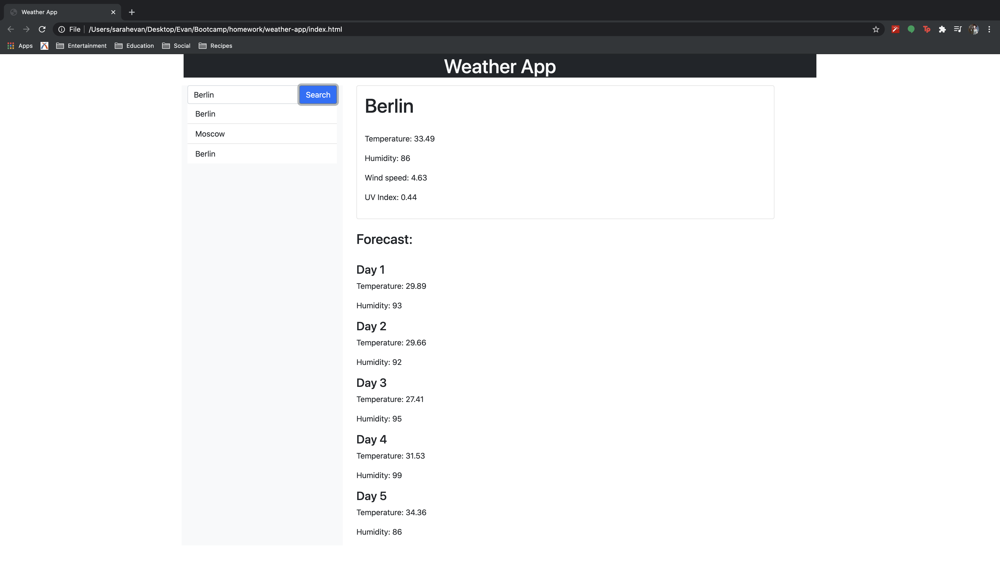

# Weather App

## Overview

This app was created to allow users to search for a location via city name. Upon clicking search, the user will be given the current weather status, including temperature, humidity, wind speed, and UV index. The user is also given a five day forecast for the location which include temperature and humidity. When the user searches for a city, a list of recently searched items will appear below the search bar, which the user may click to pull the temperature information for previously searched results.

Future commits will include current date, local time display, weather icons to match the location's current weather, display cards for the forecast, and dynamically changing UV index color.

When the webpage opens, the base webpage has nothing except the header, search bar, and the word Forecast. JQuery was used to dynamically create new html elements, add text value, and apply attributes. These attributes utilize bootstrap to help format my page. using JQuery we are able to use our personal api keys to search using the ajax function. localStorage was also used to retain search history and display it.

## Technologies utilized

Used the empty() function to remove any html or text content for a certain unit, in this case being targeted using JQuery to select a specific id.

w3schools, bootstrap, dayjs, JQuery were all used.

## Images

